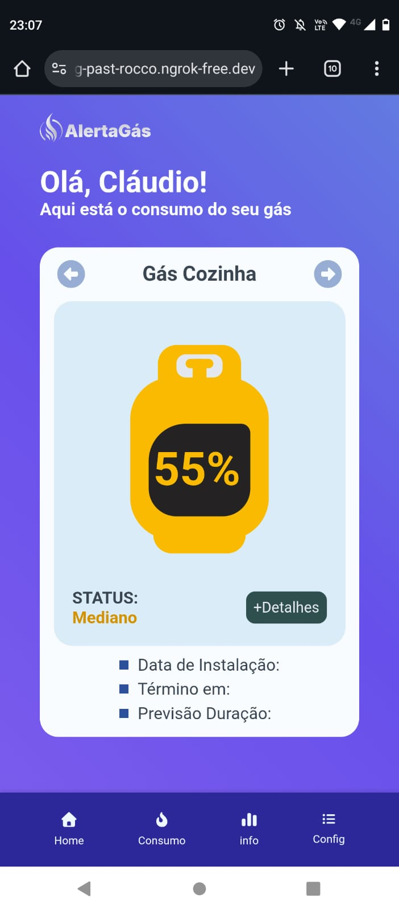

# App Gas Dashboard 🚀

## 📷 Preview da aplicação

Aplicação web desenvolvida com React e Firebase para monitoramento de dados em tempo real utilizando arquitetura cliente-servidor.

Projeto desenvolvido em equipe durante residência Front-End com foco em autenticação de usuários, integração com APIs REST e construção de dashboard responsivo.

---

## 🚀 Tecnologias utilizadas

React • JavaScript • Firebase • APIs REST • HTML • CSS • Git

---

## 📊 Funcionalidades

✔️ Autenticação com Firebase Authentication  
✔️ Dashboard interativo  
✔️ Integração com APIs REST  
✔️ Persistência de dados em nuvem  
✔️ Interface responsiva  
✔️ Componentização com React  

---

## 👨‍💻 Minha contribuição

Atuei diretamente em:

• construção da interface com React  
• componentização de elementos reutilizáveis  
• integração com Firebase  
• ajustes de responsividade  
• organização da estrutura do frontend

## 📷 Preview da aplicação

